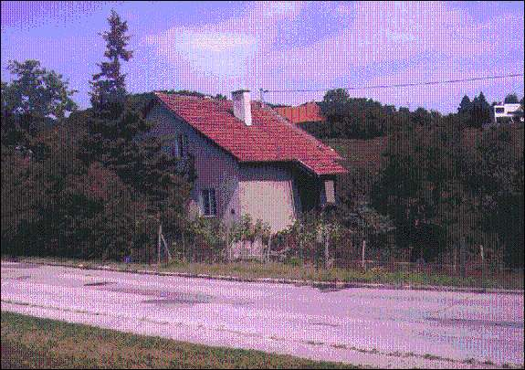

# The Java Image Processing Survival Guide

Authors: Siegfried Goeschl, Harald Kuhr

Keywords: Java, Image Scaling, Image Conversion, ImageMagick, JMagick, PDFBox, Java Advanced Imaging API, JAI, ImageIO API, TwelveMonkeys ImageIO Plugins

## Abstract

This paper provides real-life experience in replacing an ImageMagick/JMagick image conversion & scaling with a pure Java implementation covering Apache PDFBox, Java Advanced Imaging API (JAI), TwelveMonkeys ImageIO plug ins and different Java-based image-scaling libraries. 

------------------------------------------------------------------
## 1. The Customer Inquiry

A day starting with a customer inquiry - "How difficult is it to replace ImageMagick with a Java image processing library?!". A few seconds to ponder over the question - Java has graphics support built in, there is the Java Advanced Imaging API around and some image processing shouldn't be too hard after all - "Well, it depends on your exact requirements but not too difficult". 

Let's have a closer look at the customer's system - it is a classified ads platform allowing their users to create adverts and upload images over the browser or iOS & Android apps as shown below


The heavy lifting is done by ImageMagick - a native image-processing command-line tool available for most platforms. JMagick exposes ImageMagick's native code over JNI (Java Native Interface) but this approach has a few short-comings

* Any ImageMagick exceptions escaping through the JNI layer causes the JVM to terminate
* Installing the ImageMagick binaries for different target platforms requires additional work
* Getting ImageMagick/JMagick to run on Mac OS failed miserably
* JMagick is no longer actively developed and does not support all ImageMagick features

On the other hand ImageMagick is a powerful and field-proven software used by the customer for many years in order to

* Process 6 million user-uploaded images per month
* Convert arbitrary image formats such as PNG, TIFF and BMP into JPEG
* Convert PDF documents to a preview image using GhostScript under the hood
* Create five thumbnail images with varying resolution based on the user-uploaded image
* Handle a peak load of 45 image per minute and server (during batch processing)

Regarding the customer inquiry - somehow replacing ImageMagick looks difficult now.


------------------------------------------------------------------

## 2. Java 2D API Primer

There are a number of common tasks when working with images

* Reading a  GIF, PNG, JPEG image into a *java.awt.image.BufferedImage* instance using an *ImageReader*
* Apply one or more buffered image operations such as
    * Color conversation
    * Affine transformation preserving the "straightness" and "parallelness" of lines, e.g. rotation or scaling
    * Convolution operation, e.g. blurring or sharpening of an image
    * Lookup operation to translate source pixel into destination pixels colors using a lookup table, e.g. inverting the colors
* Writing the *BufferedImage* to a GIF, PNG, or JPEG image using an *ImageWriter*

The *BufferedImage* is an accessible buffer of image data, essentially pixels, and their RGB colors. A BufferedImage object is made up of two parts a ColorModel object and a Raster object

* The ColorModel object provides methods that translate an image's pixel data into color components that can be understood, such as RGB for a computer
* The Raster represents a rectangular array of pixels. A Raster encapsulates a DataBuffer that stores the sample values and a SampleModel that describes how to locate a given sample value in a DataBuffer. Basically, the Raster holds two things, a DataBuffer, which contains the raw image data and a SampleModel, which describes how the data is organized in the buffer

The Java 2D API uses an *Service Provider Interface (SPI)* to utilize image readers & writers provided by extension libraries, e.g. the *Java Advanced Imaging (JAI)* library provides JPEG2000 and TIFF image readers & writers.


------------------------------------------------------------------
## 3. The Road Ahead

Tackling this project requires some "divide and conquer" to keep the tasks manageable

* Use Apache PDFBox to create a PDF preview image
* Use ImageIO to convert various image format to JPEG
* Use JAI to read TIFF images
* Use image scaling library for thumbnail creation
* Use custom JPEG compression parameters 

### 3.1 Creating A PDF Preview Image

Nowadays there is a strong focus on beautiful user interfaces - a simple list of file names and icons is not feasible in the Web 2.0 era. Converting a PDF to a list of images is done using *Apache PDFBox* - an open source Java tool to work with PDF documents. The server-side conversion requires a bit of code since the functionality is implemented as part of the PDFBox command line tools (see http://pdfbox.apache.org/commandline/#pdfToImage). With little effort the functionality was extracted in the Java code snippet shown below

```
List<BufferedImage> pdfToImage(
    Object source, int from,
    int to, int dpi) 
{
    PDDocument pdDocument = loadPDDocument(source);
    List<BufferedImage> result = new ArrayList<BufferedImage>();
    List<PDPage> pages = pdDocument.getDocumentCatalog().getAllPages();

    for (int i = from - 1; i < to && i < pages.size(); i++) 
    {
        PDPage page = pages.get(i);
        BufferedImage image = page.convertToImage(BufferedImage.TYPE_INT_RGB, dpi);
        result.add(image);
    }
    return result;
}
```

### 3.2 Convert Image Formats to JPEG

The heavy lifting of image format conversion is provided by the Java ImageIO API (the javax.imageio package): "This package contains the basic classes and interfaces for describing the contents of image files, including metadata and thumbnails (IIOImage); for controlling the image reading process (ImageReader, ImageReadParam, and ImageTypeSpecifier) and image writing process (ImageWriter and ImageWriteParam); for performing transcoding between formats (ImageTranscoder), and for reporting errors (IIOException)." (http://docs.oracle.com/javase/7/docs/api/javax/imageio/package-summary.html#package_description)

In theory, it could be as simple as:

```
File/InputStream inFile = ...;
File/OutputStream outFile = ...;

BufferedImage image = ImageIO.read(inFile);

if (!ImageIO.write(image, format, outFile)) {
    // Handle image not written case
}
```

In reality it is more complicated 

* Some control is required regarding JPEG metadata and compression options
* Some graphic formats are not supported out of the box Java ImageIO, e.g. TIFF

### 3.3 Java Advanced Imaging

The Java ImageIO library has no TIFF or BMP support - this can be added using Java Advanced Imaging (JAI). Getting JAI installed & running is not as straight-forward as it could be

* Due to licensing issues the JAI libraries are not available on Maven Central and won't be downloaded automatically during a Maven build
* The official download links referenced by Maven Central are partly broken 
* The libraries are hard to find because the last release dates back to 10/2006

Unfortunately JAI did not work as expected - the TIFFReader classes were found on the classpath but TIFFs were not automatically processed using *ImageIO.read()*. While preparing the article the solution was found - there is actually a **third** JAI library which was somehow missing from the initial setup, the *jai_imageio.jar*.

The following JAI libraries are used (and found in the code samples)

* jai_codec-1.1.2_01.jar
* jai_core-1.1.3.jar
* jai_imageio-1.1.jar

### 3.4 Thumbnail Creation

If you have ever wanted to rescale images or create thumbnails you have probably noticed a few things:

* There seem to be too many ways to scale an image - *Image.getScaledInstance()*, *Graphics.drawImage()*, *Graphics2D.drawImage(…)*,
*BufferImageOps* and *AffineTransforms*
* There's always a trade between speed and image quality implemented by different image scaling algorithm - *Bicubic Interpolation*, *Bilinear interpolation*, *Nearest Neighbor Interpolation* or *Lanczos Resampling*

Which one are you suppose to use? Which one performs the fastest? Which one scales and uses the least amount of memory? When searching the Internet you find a plethora of image scaling libraries - in order to make an informed decision a test driver was implemented to convert a fixed set of test images using the following libraries

* imgscalr (see http://www.thebuzzmedia.com/software/imgscalr-java-image-scaling-library/)
* thumbnailator (see https://code.google.com/p/thumbnailator/) 
* java-image-scaling (see https://code.google.com/p/java-image-scaling/)

The good news are that all of them work and show comparable performance so the decision comes down to image quality and additional features. At the end "thumbnailator" was chosen due to its watermark support - this feature is not immediately needed but it is good to know that watermarking can be added using two lines of code (see https://code.google.com/p/thumbnailator/wiki/Examples#Creating_a_thumbnail_with_a_watermark).

The CPU time needed for scaling depends mostly on the size of the source image and using a naive implementation could use the original image to create the five scaled down instances. Consequently the production code uses an already scaled image to create the next smaller image which has a dramatic impact on performance as shown below

[TBD]

### 3.5 Setting JPEG Metadata

A common requirement for writing JPEGs is setting the compression options and/or DPIs this can be done with the code snippet shown below

```
int dpi = 300:
float quality = 0.8f;

// some code loading the image

IIOMetadata metadata = jpegImageWriter.getDefaultImageMetadata(new ImageTypeSpecifier(source), null);
ImageWriteParam writeParam = imageWriter.getDefaultWriteParam();

// set the DPI in the image metadata
Element tree = (Element) metadata.getAsTree("javax_imageio_jpeg_image_1.0");
NodeList nodeList = tree.getElementsByTagName("app0JFIF");
Element jfif = (Element) nodeList.item(0);
jfif.setAttribute("Xdensity", Integer.toString(dpi));
jfif.setAttribute("Ydensity", Integer.toString(dpi));
jfif.setAttribute("resUnits", "1");
metadata.setFromTree("javax_imageio_jpeg_image_1.0", tree);

// set the compression to use
writeParam.setCompressionMode(ImageWriteParam.MODE_EXPLICIT);
writeParam.setCompressionQuality(quality);

```
 
Looking at the code snippets raises a few concerns

* A fair amount of knowledge is required to accomplish a simple tasks
* The code is prone to NPEs when the JPEG metadata is not available

------------------------------------------------------------------
## 4. Hitting Real-Life Test Data

When the overall implementation was mostly finished a few hundred production and a set of custom test images were used for a more thorough testing and the results were - well - interesting. A couple of images were either not converted at all or the resulting images were severely broken - in other words the current implementation was not ready for production

The following problems were identified:

* GIF & PNG alpha-channels
* Memory usage of conversion
* CMYK color space

### 4.1 Alpha-Channels

An alpha channel stores transparency information and is used for the GIF and PNG image format on web pages so that images appear to have an arbitrary shape even on a non-uniform background. The alpha-channel handling is non-intuitive when loading transparent GIFs/PNGs and saving them to a JPEG because the colors are messed up - either all black or having a red tint as shown below

| Before                                                    | After                                                   |
| ----------------------------------------------------------| ------------------------------------------------------- |
|  |  |

This problem is caused by ImageIO using a mismatched color model when writing the JPEG image (e.g. *BufferedImage.TYPE_4BYTE_ABGR*) and can be avoided by converting the color model to *BufferedImage.TYPE_RGB* type relying on *Graphics2D.drawImage*. 

```
BufferedImage bufferedImage = createBufferedImage(sourceImageFile);
int width = bufferedImage.getWidth();
int height = bufferedImage.getHeight();
final int imageType = BufferedImage.TYPE_INT_RGB;

BufferedImage rgbBufferedImage = new BufferedImage(width, height, imageType);
Graphics2D graphics = rgbBufferedImage.createGraphics();
graphics.drawImage(bufferedImage, 0, 0, null);
graphics.dispose();
```

Please note that this problem might also occur when applying an *AffineTransformOp* since this results in a BufferedImage having a *BufferedImage.TYPE_ARGB* type [1]. 


### 4.2 Memory Usage 

During image scaling the uploaded image is read and a BufferedImage instance is created containing the rastered and un-compressed pixels. In other words the memory foot-print can be 10-20 times larger than the compressed source image which makes the operations team uneasy - a huge source image could cause excessive memory consumption which in turn can be used for a "Denial Of Service Attack". And developers hate it to be considered as the root cause for an successful DOS attack - dutifully the original image conversion source code contained the following sanity check to avoid memory problems

```
if(imageSourceFile.length() > IMAGE_FILE_SIZE_LIMIT) {
    throw new ImageConversionException("The image is too big ...");
}
```

The memory foot-print mostly depends on the image dimension - the file size of an uploaded image is misleading when compression is used. This observation leads directly to notion of "decompression bomb vulnerabilities" as described at [http://www.aerasec.de/security/advisories/decompression-bomb-vulnerability.html](http://www.aerasec.de/security/advisories/decompression-bomb-vulnerability.html). A hand-crafted unicolor PNG image containing 19.000 x 19.000 pixels uses only 44 KB of disk but potentially up to 1 GB of main memory - ooups.

In order to avoid such attacks the image metadata of the uploaded image file are retrieved - this is a fast operation which does not require to load the whole image file. But what are sensible limits regarding image size considering that

* Nikon D610 supports up to 24 mega-pixel (6016 x 4016)
* Scanned A4 page with 300 DPI results in 35 mega-pixel (7015 x 4960)
* Scanned A4 page with 600 DPI results in 140 mega-pixel (14030 x 9920)
* Nokia Lumia 1020 uses a 42 mega-pixel sensor

It was decided to use 45 mega-pixels as upper limit but this is actually a solution for the wrong problem. Instead of worrying about the dimension of uploaded images it is much smarter to scale the image on the front-end before uploading to the server conserving bandwidth and server memory. 

### 4.1 CMYK Color 

```
javax.imageio.IIOException: Unsupported Image Type
    at com.sun.imageio.plugins.jpeg.JPEGImageReader.readInternal(JPEGImageReader.java:1063)
    at com.sun.imageio.plugins.jpeg.JPEGImageReader.read(JPEGImageReader.java:1034)
    at javax.imageio.ImageIO.read(ImageIO.java:1448)
    at javax.imageio.ImageIO.read(ImageIO.java:1308)
```    
The CMYK color model is a subtractive color model used in color printing whereas most user-generated image uses the RGB additive color model. CMYK color space support is somewhat limited in Java, and there is no built-in CMYK color space, like it has for RGB. The main reason for this is that there is no standard CMYK color space. Unlike RGB that has standardized color profiles, like sRGB and AdobeRGB1998. CMYK color profiles originates from printer manufacturers and the printed press. Manufacturers and organizations have their own standardized profiles. 

Google for CMYK to RGB will come up with various mathematical formulas. Typically something like this (from [http://www.rapidtables.com/convert/color/cmyk-to-rgb.htm](http://www.rapidtables.com/convert/color/cmyk-to-rgb.htm)):

The R,G,B values are given in the range of 0..255.
The red (R) color is calculated from the cyan (C) and black (K) colors:

>  *R = 255 × (1-C) × (1-K)*

The green color (G) is calculated from the magenta (M) and black (K) colors:
 
>    *G = 255 × (1-M) × (1-K)*

The blue color (B) is calculated from the yellow (Y) and black (K) colors:

>    *B = 255 × (1-Y) × (1-K)*

This formula "works", as in that it will produce an RGB image. But unfortunately, this rather naive implementation does not provide good results, because the color spaces have nonlinear response curves and different gamut. 

So, the best way to satisfy demanding users, is to use a proper ICC color profile, and ICC color transform. This approach usually involves converting the CMYK values into a device independent color space (like Lab or CIEXyz), and then from the independent space to the destination color space (RGB). This will produce much better results. 

Luckily, most image files that use CMYK color space does have an embedded ICC  profile, and when converting we should always use this profile. If there is no embedded ICC profile, we can look for a platform specific "generic CMYK" profile. "Web coated SWOP" or similar might also do in lack of a better alternative. And only fall back to the mathematical formula above as a worst case. [This is the "algorithm" used by TwelveMonkeys, anyway... :-)]

To complicate things slightly in Java land: The default ImageIO JPEGImageReader will not read CMYK images. The most common workaround for now, is to read the image as raster, then convert the YCCK to CMYK, before finally converting to RGB using ICC profile and then creating a BufferedImage from the resulting raster.

------------------------------------------------------------------
## 5. In the Need of Twelve Monkeys

Converting CMYK to RGB color space seemed non-trivial to implement considering that the release date was around the . A *stackoverflow* entry mentioned a "TwelveMonekys" library (see [http://stackoverflow.com/questions/2408613/problem-reading-jpeg-image-using-imageio-readfile-file](http://stackoverflow.com/questions/2408613/problem-reading-jpeg-image-using-imageio-readfile-file)) which lead to a Github repository. The Twelvemonkeys libraries turned out to be a collection of plug-ins using the *ImageIO's SPI* mechanism - in other words a drop-in replacement for JAI. Running the regression test suite showed that CMYK color space was properly handled and - even more important - no new issues were introduced. 

The Twelvemonkeys ImageIO was started when Harald was working for a Web CMS (Content Management System) vendor, that created CMS solutions targeted for the media industry (newspapers, broadcast). It's a web-centric CMS, and the initial version was created, because their web content management system needed support for more image formats. 

### 5.1 A little bit of History

*** 1.x version ***

* Java (prior to J2SE  1.4) had only limited support for reading JPEG, PNG and GIF
* And more importantly, no official API for writing images existed.
* The APIs that existed was based around the java.awt.Image class, and not the more versatile BufferedImage class.
* JMagick had support for many formats, but had no stream support, which is very bad when working with web architectures. Temporary writing to disk increases the response time, and slows down overall performance. Plus the lack of binary compatibility from version to version and being a nightmare to install.
* JAI was around, but at the time reading & writing images using JAI required a different API. 
* None of the libraries had proper support for PSD format (JMagick didn't support reading individual layers)
* The initial version had a simple read/write API, that dealt with BufferedImages. 

*** 2.x version ***

Nowadays, the world is a little different, thus the goals have changed: 

* ImageIO (javax.imageio package) has become the standard API to read/write images in Java. 
* Thus the goal has been to help the Java platform read as many formats, as complete as possible, using the ImageIO API.
* JAI ImageIO has rich support for formats:
    * However, it has bugs, and when you hit them: No-one listens. Seems to have no support from Oracle. 
    * No official updates for the last years (last release was 2006)
    * Dying community for the same reasons
    * Requires native libraries for full format support/best performance. Which means more difficult installation. And worse, no native libraries exist for many modern popular architectures (ie, 64 bit architectures)
    * License issues (http://stackoverflow.com/questions/23166231/java-advanced-imaging-license). 
    * Some parts seems to be open source, some parts not (like the native code)
    * Multiple, semi-overlapping forks (GitHub, Google code, private) with the same + its own license issues, making matters worse...
* That said, if you can deal with the license, and don't run into the bugs mentioned, JAI is still the most complete and mature packages for dealing with images in Java.
* JMagick hasn't changed much. TwelveMonkeys has wrapper readers/writers to allow users to use ImageMagicks rich format support, while using the ImageIO API. However, due to the nature of the library, it will never have the same performance or rich features.
* Apache Commons Imaging has emerged from Sanselan. A quite mature library, but unfortunately has its own API. Combined with the the fact that it doesn't support all the same formats as ImageIO, this means you either have to program against multiple APIs, create your own wrappers or even your own abstraction API on top of these multiple APIs.

We need something better! We deserver better. :-)

*** 3.0 version (current) ***

* Just released (development/pre-release versions has been in use at customer sites for 2-3 years)
* Very much improved JPEG (read) support (CMYK handling, improved color profile handling, JFIF and EXIF support) over the standard JPEGImageReader that comes with the (Oracle) JRE. Solves most of the issues that usually crops up at StackOverflow
    * "Exception reading JPEG with colorspace X"
    * "Inconsistent metadata when reading JPEG"
* Full TIFF baseline support + most de facto standards + many popular extensions (read-only for now)
* Support for CMYK color space and proper ICC profile based CMYK to RGB conversion support throughout the project

### 5.2 TwevelMonkeys JPEG Plug-in

The goal is to read everything that can be read by other software - currently not doing too bad - however 

* However, because the base JPEG decoding is done by the same JNI code that the standard Java JPEGImageReader uses, we "only" support Huffman encoded, lossy JPEG, either baseline or progressive (ie, no Arithmetic encoding, no lossless compression). These are the compressions used in roughly 90% of all JPEGs in the known universe, and most web browsers supports only these types of JPEG compression as well, so in a web environment it is not much of a problem. 
* Other software here, typically means libJPEG, but also Adobe Photoshop and others. 


------------------------------------------------------------------
## 6. Production Issues

Another customer required a very similiar functionality mostly processing PDFs containing image scans. The code base was used for a couple of months by two customers each processing million of images but unsurprisingly real life is harsh on your code and exposes dormant issues. After 6 months in production the following problems were encountered

* Reliance on file names
* Segment Violation during PDF processing
* Black Borders After Image Sharpening
* Unsupported JPEG compression flavors
* Unsupported TIFF compression algorithms

## 6.1 Reliance On File Names

When uploading an image file the file name and content type of the uploaded image is passed to the server and is stored on the server's local file system. The existing code base ignored the content type and only used the file name extension to determine if the image format is supported. That's fine if all your clients use proper file names but failed sometimes for Android apps sending "image.bin". 
In general there are three bits of information to determine the content type of an uploaded image

* File names are brittle since they may end with ".bin" or have no extension at all
* Content types are a better choice but sometimes ambiguous, e.g. PDF files might be uploaded with content types of "application/pdf", "text/plain" or "application/octet-stream"
* The content of the uploaded images can be analyzed to determine it content name using so-called "magic" byte sequence which is known as "media type sniffing" or "content detection".

## 6.2 Segment Violation During PDF Processing

Out of the blue three production server went down due to a JRE crash as shown below

```
#
# A fatal error has been detected by the Java Runtime Environment:
#
#  SIGSEGV (0xb) at pc=0x00007fce89c42353, pid=20878, tid=140525025629952
#
# JRE version: Java(TM) SE Runtime Environment (7.0_45-b18) (build 1.7.0_45-b18)
# Java VM: Java HotSpot(TM) 64-Bit Server VM (24.45-b08 mixed mode linux-amd64 compressed oops)
# Problematic frame:
# C  [libawt.so+0x77353]  IntArgbPreToIntRgbSrcOverMaskBlit+0x2a3
#
```

```
Stack: [0x00007fce882c1000,0x00007fce883c2000],  sp=0x00007fce883b8428,  free space=989k
Native frames: (J=compiled Java code, j=interpreted, Vv=VM code, C=native code)
C  [libawt.so+0x77353]  IntArgbPreToIntRgbSrcOverMaskBlit+0x2a3
C  [libawt.so+0x45017]  Java_sun_java2d_loops_TransformHelper_Transform+0xeb7
j  sun.java2d.loops.TransformHelper.Transform(Lsun/java2d/loops/MaskBlit;Lsun/java2d/SurfaceData;Lsun/java2d/SurfaceData;Ljava/awt/Composite;Lsun/java2d/pipe/Region;Ljava/awt/geom/AffineTransform;IIIIIIIII[III)V+0
j  sun.java2d.pipe.DrawImage.renderImageXform(Lsun/java2d/SunGraphics2D;Ljava/awt/Image;Ljava/awt/geom/AffineTransform;IIIIILjava/awt/Color;)V+505
j  sun.java2d.pipe.DrawImage.transformImage(Lsun/java2d/SunGraphics2D;Ljava/awt/Image;IILjava/awt/geom/AffineTransform;I)V+366
j  sun.java2d.pipe.DrawImage.transformImage(Lsun/java2d/SunGraphics2D;Ljava/awt/Image;Ljava/awt/geom/AffineTransform;Ljava/awt/image/ImageObserver;)Z+17
j  sun.java2d.pipe.ValidatePipe.transformImage(Lsun/java2d/SunGraphics2D;Ljava/awt/Image;Ljava/awt/geom/AffineTransform;Ljava/awt/image/ImageObserver;)Z+17
j  sun.java2d.SunGraphics2D.drawImage(Ljava/awt/Image;Ljava/awt/geom/AffineTransform;Ljava/awt/image/ImageObserver;)Z+111
j  org.apache.pdfbox.pdfviewer.PageDrawer.drawImage(Ljava/awt/Image;Ljava/awt/geom/AffineTransform;)V+35
j  org.apache.pdfbox.util.operator.pagedrawer.Invoke.process(Lorg/apache/pdfbox/util/PDFOperator;Ljava/util/List;)V+398
j  org.apache.pdfbox.util.PDFStreamEngine.processOperator(Lorg/apache/pdfbox/util/PDFOperator;Ljava/util/List;)V+35
j  org.apache.pdfbox.util.PDFStreamEngine.processSubStream(Lorg/apache/pdfbox/cos/COSStream;)V+126
j  org.apache.pdfbox.util.PDFStreamEngine.processSubStream(Lorg/apache/pdfbox/pdmodel/PDPage;Lorg/apache/pdfbox/pdmodel/PDResources;Lorg/apache/pdfbox/cos/COSStream;)V+20
j  org.apache.pdfbox.util.PDFStreamEngine.processStream(Lorg/apache/pdfbox/pdmodel/PDPage;Lorg/apache/pdfbox/pdmodel/PDResources;Lorg/apache/pdfbox/cos/COSStream;)V+43
j  org.apache.pdfbox.pdfviewer.PageDrawer.drawPage(Ljava/awt/Graphics;Lorg/apache/pdfbox/pdmodel/PDPage;Ljava/awt/Dimension;)V+80
j  org.apache.pdfbox.pdmodel.PDPage.convertToImage(II)Ljava/awt/image/BufferedImage;+310
```

Something very similiar to an image decompression bomb had happened - a PDF containing a scan with 10200 x 13992 pixels bombed the JVM. The native code used by Java ImageIO fails to transform the image, the JRE crashes, the end-user is unhappy since the PDF upload failed multiple times (the error message saying "The image upload failed - please try again" did not work in our favour) and the operation team has a bad day.

Again an image size sanity check was added using the code snippet shown below which determines the size of embedded images.

```
PDPage page = ...
for (PDXObject embeddedObject : page.getResources().getXObjects().values()) {
    if (embeddedObject instanceof PDXObjectImage) {
        int width = ((PDXObjectImage) embeddedObject).getWidth();
        int height = ((PDXObjectImage) embeddedObject).getHeight();
    }
}
```            

## 6.3 Black Borders After Image Sharpening

Sharpening of an image is a simple convolution operation as shown below and therefore re-used for all sharpening operatins

```
BufferedImage src;
Kernel kernel = new Kernel(3, 3, new float[]{ 0.0F, -0.2F, 0.0F, -0.2F, 1.8F, -0.2F, 0.0F, -0.2F, 0.0F });
ConvolveOp sharpeningOp = new ConvolveOp(kernel).filter(src, temp);
return sharpeningOp.filter(src, temp);
```

After some time customers started complaining about black borders around their uploaded & scaled images and initially Siegfried believed that the black border was caused by the image scaling library. Strangely enough the problem did not disappear when testing with a different library. The following link ([http://www.informit.com/articles/article.aspx?p=1013851&seqNum=5|http://www.informit.com/articles/article.aspx?p=1013851&seqNum=5]) shed some light on the problem

* Convolution takes the neighbours as defined in the kernel matrix, e.g. the point in question and its eight neighbours
* Points located at the borders have not enough neighbours
* Java 2D uses a black pixel which naturally causes a black border around the sharpened image

This behaviour can be changed by using an additional paramter *ConvolveOp.EDGE_NO_OP*

```
BufferedImage src;
Kernel kernel = new Kernel(3, 3, new float[]{ 0.0F, -0.2F, 0.0F, -0.2F, 1.8F, -0.2F, 0.0F, -0.2F, 0.0F });
ConvolveOp sharpeningOp = new ConvolveOp(kernel, ConvolveOp.EDGE_NO_OP, null);
return sharpeningOp.filter(src, temp);
```

## 6.4 Thumbnailator & GIF Images

A real-estate agent complained that its pictures are of a very poor quality and the complaint was justified as shown below


| Before                                                    | After                                                   |
| ----------------------------------------------------------| ------------------------------------------------------- |
|          |          |


------------------------------------------------------------------
## 7. Image Optimization

Many images of the customer's site are user-uploaded photos of real estate adverts. They often have a poor quality

* A few photos are wrongly exposed
* Photos taken from inside an appartment often show a bright windowleaving the remaining image under-exposed
* Photos taken from a house during bright daylight leaves the house under-exposed

------------------------------------------------------------------
## 8. More & Advanced Topics

### 8.1 The JPEG File Format

Contrary to popular belief, JPEG is not a file format - it is a standardized image compression scheme. When someone says "JPEG file" most people refer to one of two main file formats that uses JPEG compression:

* JFIF (JPEG Interchange File Format), the original format described by the Joint Photographic Experts Group (JPEG)
* Exif (Exchangeable image file format), used by digital cameras

Strictly, these are incompatible, as both standard specifies that their APP marker must be the first APP marker in the file. But most software happily reads either as a "JPEG" as they conform to the structure defined in JIF (JPEG Interchange Format). 

Large software vendors (like one that starts with a capital 'A') have their own extensions, like CMYK-encoded JPEGs and many encoders also like to put Exif metadata inside an otherwise conforming JFIF file. 

The standard Java JPEGImageReader on the other hand isn't always that happy with these extensions, so you might see exceptions like:

> Inconsistent metadata read from stream

Java has no good support for lossless JPEG (known as "JPEG Lossless") nor has it any good suport for or JPEG LS, but that is a completely different (!) compression scheme.

Also missing is support for "Arithmetic coding" (as opposed to the default "Huffman coding").

(and combinations of the above).

Arithmetic coding yield a slightly better compression ratio (5-7% accoring to Wikipedia) than Huffman coding, but is far less widespread, probably due to licensing issues and also being more CPU-intensive for encoders/decoders. 

Trying to decode a JPEG Lossless using the default Java JPEGImageReader results in an exception, stating:

> Unsupported JPEG process: SOF type 0xcb

### 8.2 TIFF

TIFF stands mainly for "Thousands of Incompatible File Formats" wheras Wikipdia also mentions "Tagged Image File Format".  TIFF was originally developed by Aldus, now owned by Adobe, and is not specified by an ISO or any other standards comitee. So TIFF mainly consists of TIFF 6.0 by Adobe plus some extra ammendments.

The key strength of TIFF - its flexibility based on header tags - is also it's greatest weakness (assuming that you have to process it)

A TIFF can store the following image types

- Black and white (bilevel) images (TIFF class B)
- Bilevel Fax data (TIFF class F) (spec!) maintained by International Telephone and Telegraph Consul- tative Committee (CCITT)
- Gray data (TIFF class G)
- Indexed color (palette) data (TIFF class P)
- RGB image data (TIFF class R)
- YCbCr data (uncompressed or in JPEG format) (TIFF class Y)
- CMYK data ("TIFF class C")
- Camera RAW data: TIFF/EP or DNG

In addition TIFF supports the storage of

- Single images
- Multipage documents
- Multiple versions (sizes) of the same image (pyramidal TIFF)
- Interleaved image data
- Planar data
- In unsigned integer format using 1, 2, 4, 8, 16 or 32 bits per pixel
- In floating point format
- ICC profiles

TIFF supports the following compression formats in addition to uncompressed data

- Modified Huffman
- Packbits
- LZW (with or without prediction)
- Deflate/Zip (with or without prediction)
- JPEG (in multiple flavors)
- JPEG2000
- JBIG
- JBIG2
- the list goes on and on

It's virtually practically impossible to support all possible combinations of TIFF therefore the term *Baseline TIFF* was born. *Baseline TIFF* define a specific subset for specific needs such as

- Exif
- TIFF/EP and DNG
- TIFF class F (Facsimile documents)

Recent usage:

- TIFF is also the basis of Exif, used in digital camera formats (JPEGs)
- TIFF/EP and Adobe DNG (Digital Negative)

Interestingly TIFF also has some limitations stemming from its age

- Internal file lengths and offsets are recorded as 32 bit unsigned integers
- Maximum file size of 4 GB
- BigTIFF proposal that removes this limitation, has been "in progress" for years, still no formal/approved specification.

### 8.3 ICC Color profiles and Color conversion

As mentioned above, converting between color spaces, usually involves ICC color profiles and color transforms. Luckily for us, ICC profiles and conversion has good support in Java, although the functionality is somewhat hidden.

The Java class ColorSpace is used to represent color spaces in Java. It has a subclass, ICC_ColorSpace for color spaces based on ICC profiles, and a corresponding ICC_Profile class to represent the profile itself. 

Color conversion between color spaces and color profiles is handled by the ColorConvertOp. On most platforms, this class delegates to native code to do the actual transformation, making it very fast and efficient. In most cases, magnitudes faster than naive conversion implemented in Java.

Unfortunately, certain profiles contains issues that causes crashes or exceptions in Java:

* [Why does loading this jpg using JavaIO give CMMException?](http://stackoverflow.com/questions/4470958/)
* [Exception “java.awt.color.CMMException: Invalid image format” thrown when resizing certain images…why?](http://stackoverflow.com/questions/12288813/)
* [CMMException when parsing jpeg](https://github.com/haraldk/TwelveMonkeys/issues/34)

These profiles/issues must be recognized and dealt with before they are instantiated and passed to the ColorConvertOp filter. 

In addition, Java 8 creates some new issues, as Oracle has been replacing the rather aging KCMS (developed by Kodak) with Little CMS (LCMS). The upside with the switch to LCMS though, is a more compatible, better maintained and robust CMM system. However, the short-term downside is that current benchmarks shows it is slower, and it's not 100% compatible with KCMS [as shown by various bugs, like https://github.com/haraldk/TwelveMonkeys/issues/41]. 

Fortunately previous behavior can be restored for now, using a special switch:

    -Dsun.java2d.cmm=sun.java2d.cmm.kcms.KcmsServiceProvider

It's probably a good idea to do so, until libraries and frameworks have been updated to work fully with LCMS or inconsistencies has been worked out. Will have to fix the library at some point. 

Note that loading Custom ColorSpaces will eat memory. When loading many images at once reusing ICC profiles is a good idea. Many images contains embedded standard profiles, that will already be loaded by the JVM. But, be aware! ICC_Profile objects are mutable. It's therefore important to use these mutation operations with care, and make sure you either work on a non-shared instance or create a local copy before making changes. 


------------------------------------------------------------------
# References

[1] Willis Blackburn, "Saving JPEGs ImageIO Gotchas", [http://originalwhatever.blogspot.co.at/2008/08/saving-jpegs-imageio-gotchas.html](http://originalwhatever.blogspot.co.at/2008/08/saving-jpegs-imageio-gotchas.html)

------------------------------------------------------------------
# Unused Snippets
------------------------------------------------------------------

### 8.x Image Metadata

The ImageIO DOM-based metadata is hard to work with.

Often, this is not the metadata you want. Humans typically wants Exif or IPCT metadata, containing copyright, date, photographer etc.

#### 3.1 [this is all unofficial and this is becoming too much like a commercial, so I'm fine with skipping this part ]
 - CMYK JPEG write support, better JPEG metadata support
 - TIFF write support, TIFF metadata support
 - PNM read/write, metadata support
 - CR2 support (limited read, thumbnail), TIFF/EXIF metadata
 - (maybe JPEG lossless reading)

### On-the-fly conversion of images

Servlet Filter based.
Reads the image from source, writes the scaled version directly to the response stream (alternatively through a cache).

Pros:

- May save disk space
- Saves up-front work that may slow down workflow
 
Cons:

- Needs more resources for the (first) request
- More complicated setup (caching etc)

TwelveMonkeys comes with a set of chainable filters that allows different conversions and effects to be applied to images "on-the-fly".

- Resampling (scaling)
- Cropping (create different aspects)
- Color conversion or effects (like grayscale, vintage/lomo look etc)
- Watermarking
- Content negotiation
- Format conversion (any format to web format like JPEG or PNG)

---------------
